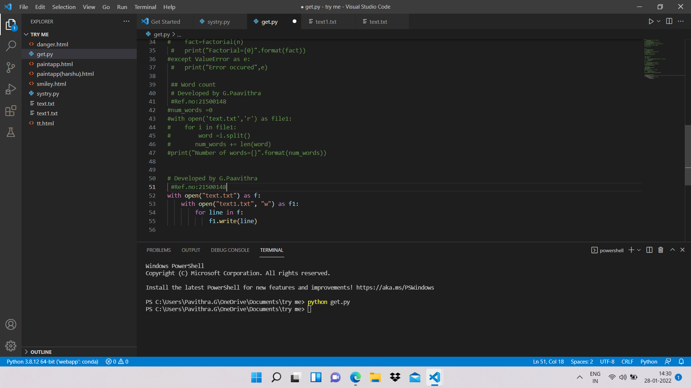
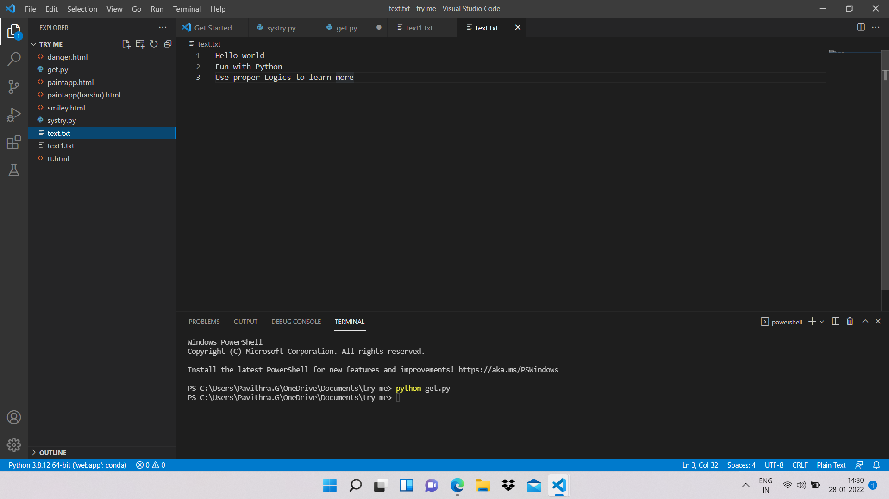

# copy-file
## AIM:
To write a python program for copying the contents from one file to another file.
## EQUIPEMENT'S REQUIRED: 
PC
Anaconda - Python 3.7
## ALGORITHM: 
### Step 1:
First we need to open the required file from which 
we need to copy the text.
### Step 2: 
Using keyword "with" to open the  required file.
### Step 3: 
Again using the with keyword to open the empty file.
### Step 4:  
The empty file is open by using 'w' which is used to write only.
### Step 5: 
The for function is used to take each line from the main file.
### Step 6: 
write() is used to write the lines of main file to the empty file or to the directed file.
## PROGRAM:
### with open("test.txt") as f:
###     with open("out.txt", "w") as f1:
###         for line in f:
###            f1.write(line)

### OUTPUT:

## RESULT:
Thus the program is written to copy the contents from one file to another file.